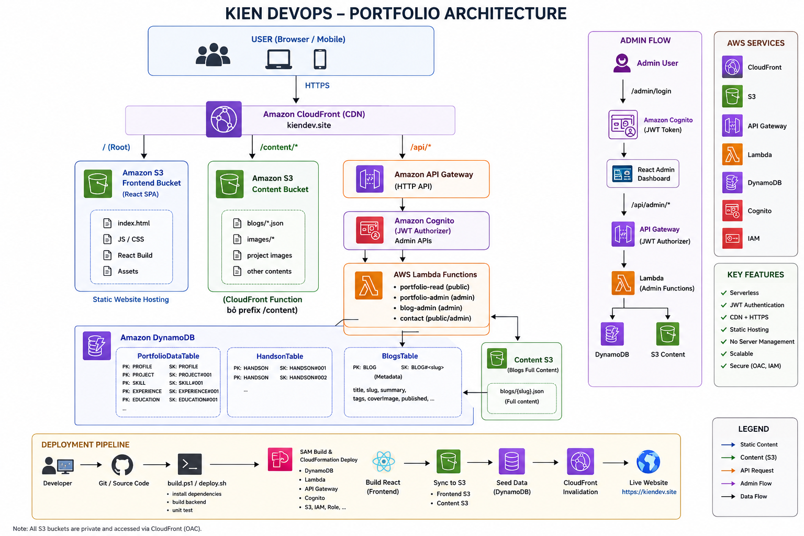
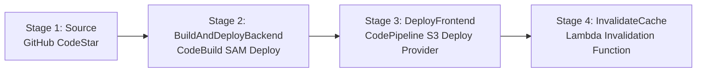

# AWS Serverless Portfolio Website

A complete, high-performance, and cost-optimized developer portfolio website built using React, Vite, TypeScript, and a 100% serverless architecture on AWS (Lambda, API Gateway, DynamoDB, S3, CloudFront, CodePipeline, CodeBuild).

* **Live Website**: [https://kiendev.site](https://kiendev.site) | [https://www.kiendev.site](https://www.kiendev.site)
* **AWS Region**: `ap-southeast-1` (Singapore)

---

## 1. Architecture & Request Flow



This project follows the **AWS Well-Architected Framework** for serverless workloads. All S3 buckets are private, and content delivery is fully mediated by CloudFront with Origin Access Control (OAC).

```text
                        [ Visitor Browser ]
                                 │
                                 ▼
                    [ Amazon CloudFront CDN ]
                      (kiendev.site / www.kiendev.site)
                                 │
            ┌────────────────────┼────────────────────┐
            │ /                  │ /content/*         │ /api/*
            ▼                    ▼                    ▼
    [ S3 Frontend ]      [ S3 Content ]       [ API Gateway ]
    - index.html         - blogs/index.json   (HTTP API v2)
    - JS/CSS bundles     - blogs/{slug}.json          │
    - Static assets      - images/blogs/*             ▼
                         - images/profile/*   [ AWS Lambda ]
                                                      │
                                                      ├──────────────┐
                                                      ▼              ▼
                                                [ DynamoDB ]   [ CloudWatch ]
                                                - Profile      - Logs & Alarms
                                                - Skills
                                                - Experience / Certs
                                                - Contacts
```

### Path Behaviors
1. **Default Cache Behavior (`*`)**: Points to the **Frontend S3 Bucket** containing compiled React single-page application.
2. **Static Content Behavior (`/content/*`)**: Points to the **Content S3 Bucket**. Associates a viewer-request **CloudFront Function** to strip the `/content` prefix.
3. **API Behavior (`/api/*`)**: Points to **Amazon API Gateway HTTP API**. Cache is disabled, and requests are routed directly to backend Lambda functions.

---

## 2. CI/CD Pipeline Architecture

The project features a fully automated 4-stage deployment pipeline managed by AWS CodePipeline:



1. **Source**: Monitors the `main` branch of `Kien-devops/portfolio` via AWS CodeStar Connection.
2. **BuildAndDeployBackend** (CodeBuild):
   - Runs backend unit tests (`vitest`) and type checking.
   - Compiles TypeScript Lambdas using `esbuild`.
   - Deploys backend SAM infrastructure (`sam deploy --resolve-s3`).
   - Builds production React frontend bundle (`npm run build:frontend`).
   - Uploads blog and static content to the Content S3 bucket.
   - Emits `FrontendArtifact` containing `frontend/dist/**/*`.
3. **DeployFrontend** (Amazon S3 Deploy Provider):
   - CodePipeline automatically extracts and synchronizes `FrontendArtifact` directly into the private Frontend S3 bucket.
4. **InvalidateCache** (AWS Lambda Invoke):
   - Triggers `serverless-portfolio-prod-invalidate-cache` Lambda function to invalidate CloudFront cache (`/*`) so changes are visible instantly.

---

## 3. Technical Stack

* **Frontend**: React 18, Vite 5, TypeScript, Tailwind CSS v4, React Router 6, Lucide React, Marked (Markdown parser).
* **Backend**: Node.js 20, TypeScript, AWS SDK v3, AWS Lambda, API Gateway HTTP API v2, DynamoDB Document Client.
* **Infrastructure as Code**: AWS SAM (Serverless Application Model), CloudFormation.
* **CI/CD**: AWS CodePipeline, AWS CodeBuild, Amazon S3 Deploy Provider, AWS CodeStar Connections.
* **Content Delivery & Security**: CloudFront Origin Access Control (OAC), ACM (SSL/TLS in `us-east-1`), IAM Least-Privilege policies.
* **Cost Optimization**: On-demand Lambda concurrency, DynamoDB `PAY_PER_REQUEST` billing, EventBridge warm-start schedule (0 cold starts).

---

## 4. Directory Layout

```text
portfolio/
├── model.png                             # Architecture diagram
├── template.yaml                         # AWS SAM infrastructure definition (IaC)
├── pipeline.yaml                         # AWS CodePipeline CI/CD CloudFormation template
├── buildspec.yml                         # CodeBuild specification for backend & frontend build
├── buildspec-frontend-deploy.yml         # Standalone S3 sync reference
├── frontend/                             # React Single Page App (Vite + TS + Tailwind v4)
│   ├── src/
│   │   ├── components/                   # ThemeToggle, Header, Footer
│   │   ├── layouts/                      # Main Layout
│   │   ├── pages/                        # Home, BlogDetail
│   │   ├── services/                     # API client
│   │   ├── types/                        # Shared TypeScript structures
│   │   └── App.tsx                       # Client router setup
│   └── package.json
├── backend/                              # Lambda Handlers (TypeScript)
│   ├── functions/
│   │   ├── portfolio-read/               # Public GET endpoints (profile, projects, skills, blogs)
│   │   ├── contact/                      # Public contact form submission & spam honeypot
│   │   └── invalidate-cache/             # CloudFront cache invalidation (Direct & CodePipeline)
│   ├── shared/                           # Shared DynamoDB client, response helpers, validations
│   └── package.json
├── content/                              # Markdown blog posts and media assets
│   ├── blogs/                            # Blog posts (.json metadata & content)
│   └── images/                           # Profile, project, and blog pictures
└── scripts/                              # Utility scripts
    ├── seed-data.ts                      # Seeds DynamoDB tables with profile & certifications
    ├── upload-content.ts                 # Syncs blog content to S3 Content bucket
    ├── deploy.ps1                        # Windows manual deployment script
    └── deploy.sh                         # Linux/macOS manual deployment script
```

---

## 5. Local Development Setup

### Prerequisites
* **Node.js**: v20+ recommended (`node --version`)
* **AWS CLI**: [AWS CLI v2](https://aws.amazon.com/cli/) configured with proper credentials (only for deployment)
* **AWS SAM CLI**: [SAM CLI](https://docs.aws.amazon.com/serverless-application-model/latest/developerguide/install-sam-cli.html) (only for local infrastructure testing)

### Step 1: Install Dependencies
```bash
npm install
```

### Step 2: Seed Mock Assets Locally
Generate local placeholder images and mock blogs for local preview:
```bash
npx tsx scripts/upload-content.ts
```

### Step 3: Run Frontend Development Server
```bash
npm run dev:frontend
```
Open [http://localhost:3000](http://localhost:3000) in your browser.

---

## 6. Running Tests

Run backend unit tests (covers input validation, honeypot spam detection, and response structure):
```bash
npm run test:backend
```

---

## 7. Deployment Guide

### Option A: Automated CI/CD (Recommended)
Once the CI/CD pipeline is deployed via [pipeline.yaml](file:///e:/repo/portfolio/pipeline.yaml), simply push your changes to GitHub:
```bash
git push origin main
```
AWS CodePipeline will automatically build, test, deploy the backend via SAM, sync the frontend to S3, and invalidate CloudFront cache.

### Option B: Manual CLI Deployment

**Windows PowerShell**:
```powershell
.\scripts\deploy.ps1 `
  -Environment prod `
  -Region ap-southeast-1 `
  -CustomDomainName kiendev.site `
  -ACMCertificateArn arn:aws:acm:us-east-1:404063515739:certificate/7f84066e-d34c-4959-bcde-6849565c8c90
```

**Linux / macOS**:
```bash
chmod +x ./scripts/deploy.sh
./scripts/deploy.sh prod serverless-portfolio ap-southeast-1 kiendev.site \
  arn:aws:acm:us-east-1:404063515739:certificate/7f84066e-d34c-4959-bcde-6849565c8c90
```

---

## 8. Custom Domain & DNS Setup

To attach a custom domain (`kiendev.site` and `www.kiendev.site`):

1. **Request Certificate in `us-east-1`** (CloudFront requires certificates to be in `us-east-1`):
   ```bash
   aws acm request-certificate \
     --domain-name kiendev.site \
     --subject-alternative-names www.kiendev.site \
     --validation-method DNS \
     --region us-east-1
   ```
2. **DNS Validation**: Add the CNAME records provided by ACM in your domain registrar / DNS provider.
3. **Deploy Stack with Certificate**: Pass the `ACMCertificateArn` and `CustomDomainName` to `template.yaml` and `pipeline.yaml`.
4. **Point DNS to CloudFront**: Add Alias/CNAME records in DNS pointing `kiendev.site` and `www.kiendev.site` to the CloudFront distribution domain name (`d214bok7nbluuq.cloudfront.net`).

---

## 9. Cost Estimation

Under standard personal portfolio traffic (< 10,000 visitors/month), monthly AWS costs are essentially **$0.00** (well within the AWS Free Tier):

| Service | Pricing Metric | AWS Free Tier | Estimated Monthly Cost |
| :--- | :--- | :--- | :---: |
| **CloudFront** | Data Transfer Out | 1 TB / month free | **$0.00** |
| **S3** | Storage & API Calls | 5 GB storage, 20k GETs | **$0.00** |
| **AWS Lambda** | Requests & Compute | 1M requests & 3.2M sec | **$0.00** |
| **API Gateway** | HTTP API Requests | 1M calls / month free | **$0.00** |
| **DynamoDB** | On-Demand (PAY_PER_REQUEST) | 25 GB storage free | **$0.00** |
| **CodePipeline** | Active Pipelines | 1 active pipeline free | **$0.00** |
| **CodeBuild** | Build Minutes | 100 general.small min/mo | **$0.00** |
| **ACM** | Public SSL Certificates | Unlimited public certs | **$0.00** |

---

## 10. Security & Well-Architected Practices

* **Zero Public S3 Buckets**: Static assets and content are 100% private and accessible only through CloudFront using Origin Access Control (OAC) with SigV4 request signing.
* **Least Privilege IAM**: Every Lambda execution role is scoped specifically to its target DynamoDB tables or CloudFront distribution ARN.
* **Honeypot Spam Protection**: The contact form Lambda includes hidden anti-bot detection fields to block spambots without annoying CAPTCHAs.
* **HTTPS Everywhere**: HTTP traffic is automatically redirected to HTTPS with minimum TLS 1.2 enforcement.
* **Native Invalidation**: The dedicated `invalidate-cache` Lambda integrates natively with CodePipeline to guarantee that users always receive the freshest assets after every release.
